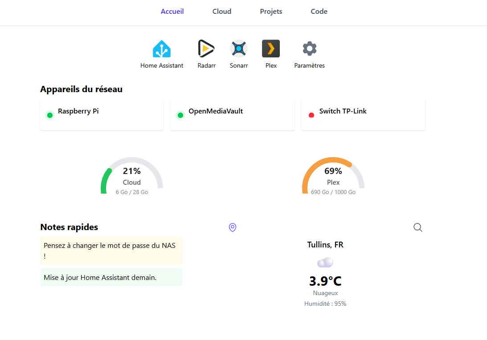

# 👋 Salut, moi c’est Bastien

🎯 **Développeur Web passionné** entre Voiron et Grenoble, spécialisé dans la création de sites et d’applications web dynamiques.  
Je conçois des interfaces user-friendly & accessibles, et je relève volontiers tous les défis techniques !

---

## 🚀 Compétences principales

  
  
  
  
  

- **Front-end :** HTML5, CSS3, JavaScript, React  
- **Back-end :** PHP, SQL
- **Outils :** GitHub, VSCode

---

## ⭐ Projets majeurs

| Projet        | Description                                                                                                                             | Stack         |
|---------------|-----------------------------------------------------------------------------------------------------------------------------------------|--------------|
| [Portfolio](https://github.com/Bastien150/projetEpoka)        | Présentation interactive de mon parcours et de mes deux stages. • **Hardis Group** : appli Python avec QT • **Laboratoire GSCOP** : dashboard avec ChartJS, JavaScript, PHP, API | JavaScript, PHP, HTML, CSS |
| [Projet Fin d'année BTS](https://github.com/Bastien150/projetEpoka) | Calculateur de frais kilométriques avec gestion des rôles. Accès sécurisé pour l’administration. | PHP, CSS |
| [Boutique Plantes](https://github.com/Bastien150/app-plant-react)   | Premier projet React : boutique de plantes avec gestion de panier et de filtres.                       | React, JavaScript, HTML, CSS |
| [Projets 1ère année BTS](https://github.com/Bastien150/serveur-web) | Plusieurs petites apps : palindrome, flashcards, todo list. Découverte de PicoCSS et des bases du web.            | JavaScript, PHP, HTML, PicoCSS |

---

## ✨ Projet Perso Principal

**💡 Dashboard personnel** regroupant toutes les informations utiles à mon quotidien, développé et hébergé sur mon propre **Raspberry Pi**.  
Il sert de centre de contrôle et d’accès rapide à mes outils et services :

- 🔗 **Raccourcis & Liens utiles** → intégration avec *Home Assistant* et autres liens locaux
- 🌍 **WireGuard VPN** → accès sécurisé à mon réseau domestique
- 🚫 **Pi-Hole** → bloqueur de publicités et suivi en temps réel
- ☁ **Cloud personnel** → sauvegarde de fichiers et visualisation via une interface PHP
- ⚡ Interface optimisée et responsive pour un accès depuis tout appareil

**Stack technique :** React · PHP · SQL · Tailwind
**Infrastructure :** Hébergé sur Raspberry Pi

---

## 🌱 En ce moment j’apprends :

- React 
- Optimisation des interfaces, bonnes pratiques web  
- Curiosité : automation & API, Domotique, ESP32

---

## 📬 Me contacter

- **Email :** [bastienforest01@gmail.com](mailto:bastienforest01@gmail.com)
- **LinkedIn :** [Mon profil](https://www.linkedin.com/in/bastien-forest-294b3a2bb/)
- **Portfolio :** [glubul.ovh/portfolio](https://glubul.ovh/portfolio)

---

> Merci d’avoir visité mon profil !  
_N’hésitez pas à découvrir mes projets ou à me contacter pour discuter ou collaborer 🚀_

---

